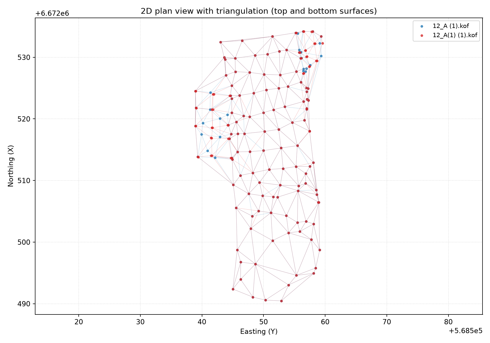
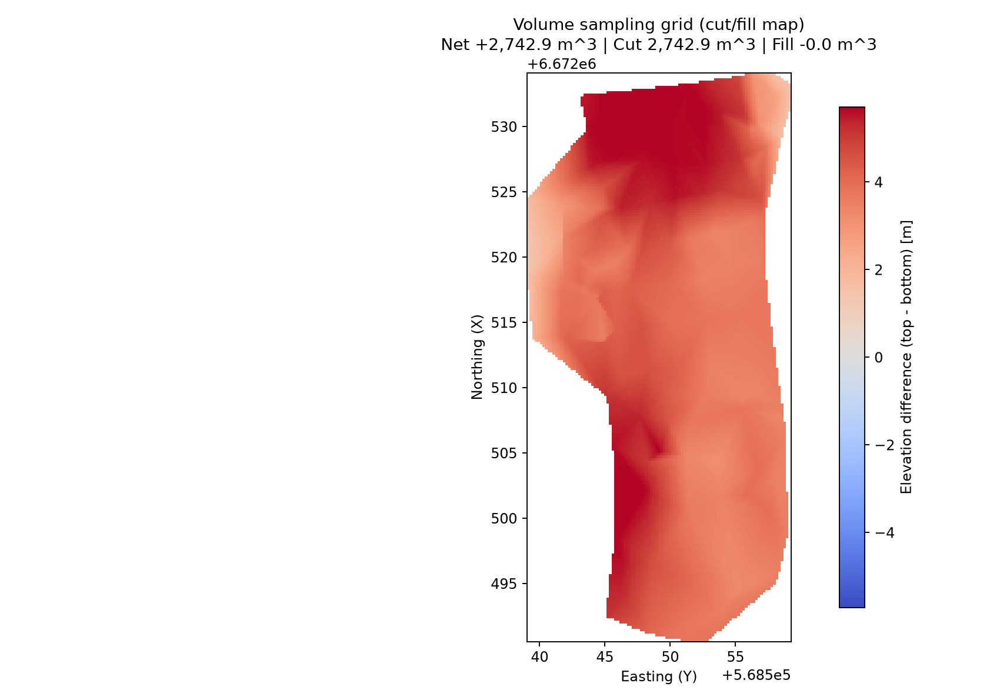
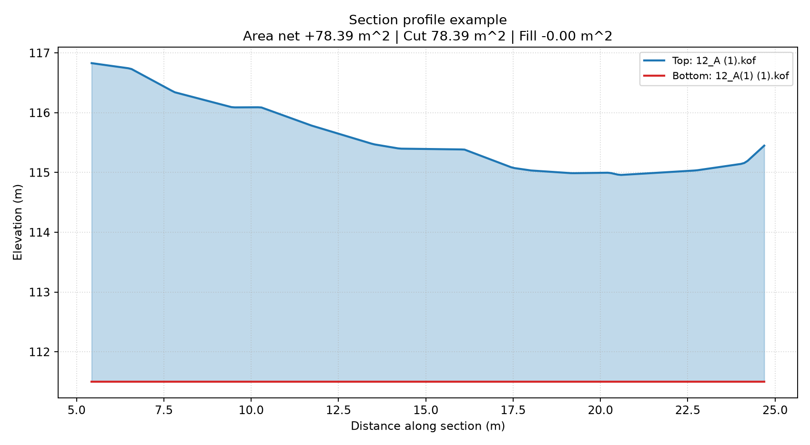

# KOFvision

KOFvision is a standalone Python viewer for KOF survey files with:

- 2D and 3D visualization
- KOF polyline parsing (`09 91` ... `09 99` / `09 96`)
- surface triangulation (Delaunay)
- cut/fill volume calculation between two surfaces
- interactive section drawing and profile charts

The main app is implemented in `kof_viewer.py`.

## Features

- Open one or more `.kof` files
- Plot points/polylines in 2D plan view
- Plot points/polylines in 3D with optional triangulated surface
- Toggle labels, markers, lines, triangulation, and equal aspect mode
- Load a georeferenced orthophoto/raster background in the 2D tab
- Toggle file layers and raster layer from the Layers panel
- Zoom 2D view to selected (visible) layers
- Select top and bottom surfaces and compute:
	- net volume
	- cut volume
	- fill volume
	- overlap area
- Draw one or more section lines in 2D and open section windows with:
	- top and bottom profiles
	- shaded cut/fill regions
	- net/cut/fill cross-section area

## Requirements

- Python 3.10+
- `numpy`
- `matplotlib`
- `scipy`
- `tkinter` (usually included with standard Python installers)

Install Python dependencies:

```bash
pip install numpy matplotlib scipy
```

## Run

Start empty and load files from the UI:

```bash
python kof_viewer.py
```

Or preload one or more KOF files:

```bash
python kof_viewer.py "12_A (1).kof" "12_A(1) (1).kof"
```

## Workflow

1. Open two surface files (for example existing top and design/bottom).
2. Select Top and Bottom in the second toolbar row.
3. Choose volume Method (`raster` or `triangles`).
4. Optionally enable Triangulation.
5. Click Compute volume.
6. Read net/cut/fill in the toolbar summary.
7. Click Draw section and pick two points in 2D to open a section profile window.

### View Controls

- Zoom to selected layers: fit the 2D view to visible layers.
- Reset view: clear manual zoom and return to auto extents.

## Raster Background (Orthophoto)

The 2D tab can display a raster image as background (for example orthophoto)
behind KOF points and polylines.

Use the top toolbar:

- Open raster...: load raster image (`.jpg`, `.jpeg`, `.png`, `.tif`, `.tiff`, `.bmp`)
- Raster alpha: control transparency
- Clear raster: remove the loaded raster

Raster visibility is controlled in the left Layers panel, where raster appears
as its own layer entry.

### Georeferencing Requirements

Raster placement uses a world file next to the image. Supported world-file naming:

- `.jgw`, `.jpgw`, `.jpegw` for JPEG
- `.pgw`, `.pngw` for PNG
- `.tfw`, `.tifw`, `.tiffw` for TIFF
- `.bpw`, `.bmpw` for BMP
- `.wld` fallback

Notes:

- Raster and KOF data must be in the same projected CRS for proper alignment.
- Rotated world files (non-zero rotation terms) are currently not supported.
- Very large rasters are automatically loaded as a downsampled preview for
	faster display; georeferencing still uses full-resolution world-file metadata.

## Boundary Tightness

The Boundary tightness control filters long triangulation edges (relative to the median edge length).

- Lower values: tighter concave boundary (drops more outer triangles)
- Higher values: looser boundary (keeps more triangles)

If you change this value after computing volume, the app marks the result as stale and you should recompute.

## Example Images

These images are generated from the included sample files:

- `12_A (1).kof`
- `12_A(1) (1).kof`

### 2D Plan + Triangulation



### Volume Sampling (Cut/Fill Map)



### Section Profile Example



## Regenerate README Images

A helper script is included to regenerate the images:

```bash
python scripts/generate_readme_images.py
```

It writes PNG files to `docs/images/`.

## Notes

- Coordinates are interpreted as:
	- `X` = Northing
	- `Y` = Easting
	- `H` = Elevation
- Volume method options:
	- `raster` (default): grid sampling over overlapping extents of the triangulated surfaces.
	- `triangles`: direct integration over overlapping triangle polygons from both surfaces.
- Interpolation outside the filtered triangulation boundary is ignored.
